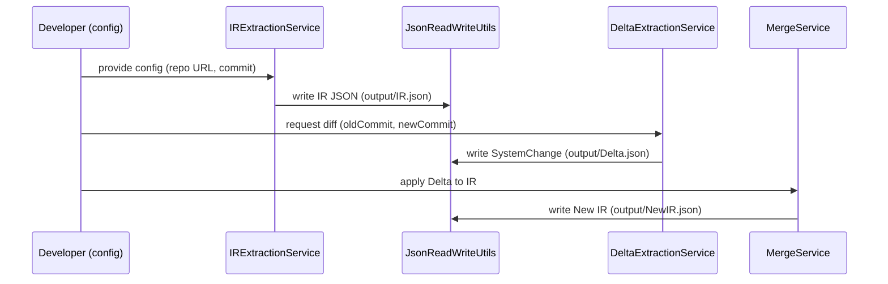

Architecture Overview
=====================

High-level components
---------------------
This library is organized into a set of clear responsibilities implemented as Java services.

Packages and responsibilities
- `edu.university.ecs.lab.intermediate.create.services` — IRExtractionService
  - Clones repositories, detects microservice boundaries and extracts the IR.
- `edu.university.ecs.lab.delta.services` — DeltaExtractionService
  - Computes SystemChange objects between two commit IDs.
- `edu.university.ecs.lab.intermediate.merge.services` — MergeService
  - Applies a SystemChange (delta) to an existing IR to produce a new IR for a newer commit.
- `edu.university.ecs.lab.common.services` — JsonSchemaService, JsonSchema utilities
  - Generates JSON Schema docs from the Java model classes.
- `edu.university.ecs.lab.common.models.ir` — model classes for MicroserviceSystem, Microservice, ProjectFile, AbstractClass, JClass, Endpoint, RestCall, MethodCall, etc.
- `edu.university.ecs.lab.common.utils` — FileUtils, JsonReadWriteUtils, SourceToObjectUtils (parsing helpers)

Data flow
---------
1. IRExtractionService reads configuration, clones repos, scans files to build a MicroserviceSystem in memory.
2. IR can be written to `output/` as JSON using JsonReadWriteUtils.
3. DeltaExtractionService compares two commits and generates a SystemChange (list of Deltas).
4. MergeService applies SystemChange to an existing IR to synthesize a new IR reflecting the newer commit.

Where to find things in the code
-------------------------------
- `src/main/java/edu/university/ecs/lab/intermediate/create/services/IRExtractionService.java`
- `src/main/java/edu/university/ecs/lab/delta/services/DeltaExtractionService.java`
- `src/main/java/edu/university/ecs/lab/intermediate/merge/services/MergeService.java`
- `src/main/java/edu/university/ecs/lab/common/models/ir/` — model classes
- `src/main/java/edu/university/ecs/lab/common/utils/` — helpers

Design notes
------------
- Models are Jackson-serializable and the project provides JsonSchemaService to generate a contract for JSON consumers.
- File path normalization and cross-OS compatibility are handled centrally in FileUtils.

Sequence diagram (Mermaid)
--------------------------
Below is a simple sequence visualization of the main flow (IR extraction → delta → merge):

Notes
-----
- Keep the flow idempotent: modules should not mutate input files in place; they write to `./output/`.
- The sequence above is intentionally linear for clarity — the implementation includes checks for partial IRs and caching of intermediate results.
